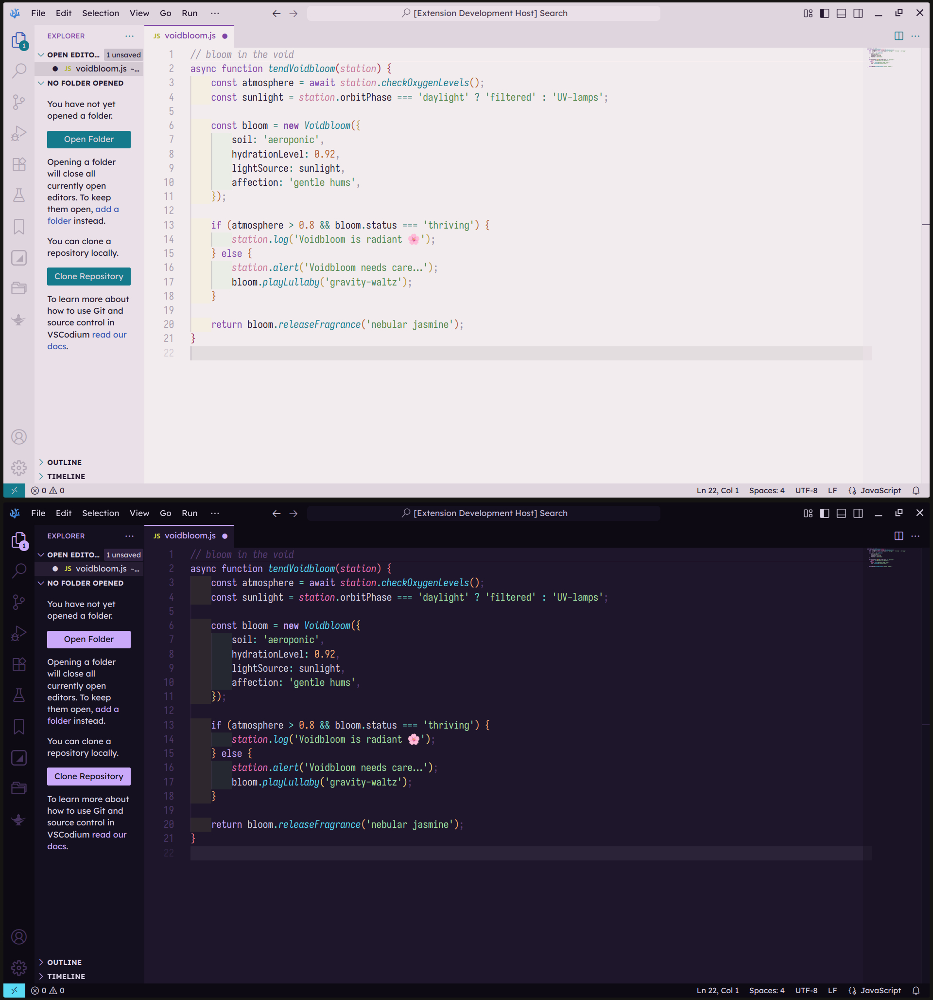
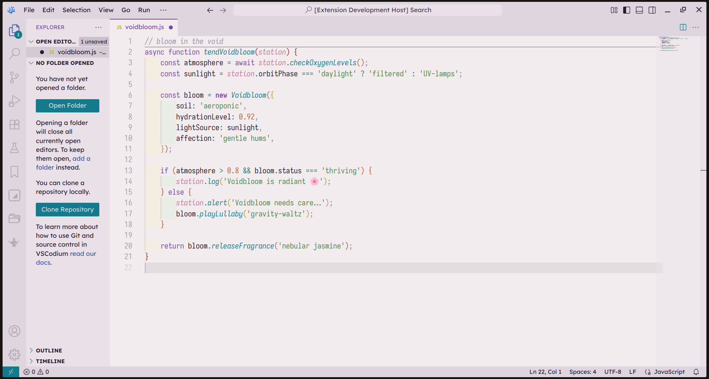
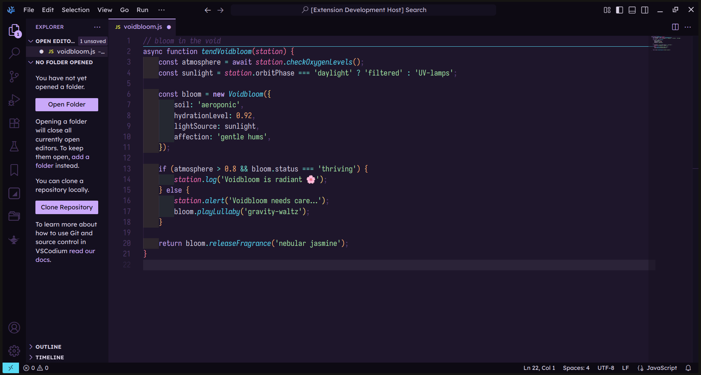

<h3 align="center">
	 
	voidbloom <a href="https://code.visualstudio.com">VSCode</a> theme
</h3>

    

  

Quazar

Singularity

## Installation

### Marketplace

- [Visual Studio Marketplace](https://marketplace.visualstudio.com/items?itemName=emery2547.voidbloom)

### Manual Installation

1. Download [the latest release](https://github.com/emery2547/voidbloom-vscode/releases/tag/release).
2. In VSCode, open the Command Palette, select `Extensions: Install from VSIX...` and select the downloaded file.

## Support & Development

If you encounter any issues or have any questions or suggestions, please open an issue [here](https://github.com/emery2547/voidbloom-vscode/issues?q=sort%3Aupdated-desc+is%3Aissue+is%3Aopen).

Please also feel free to edit this theme and create a [fork](https://github.com/emery2547/voidbloom-vscode/fork).

## Thank You

- [catppuccin](https://github.com/catppuccin)
- [Rosé Pine](https://github.com/rose-pine/rose-pine-theme)
- [Synthwave '84](https://github.com/robb0wen/synthwave-vscode)